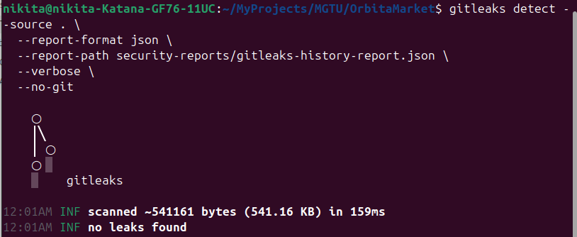
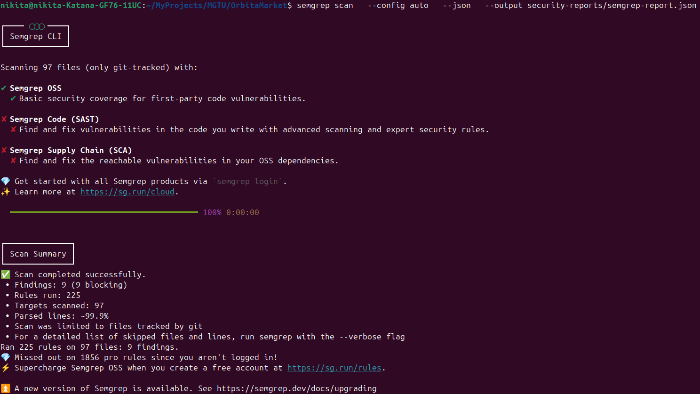
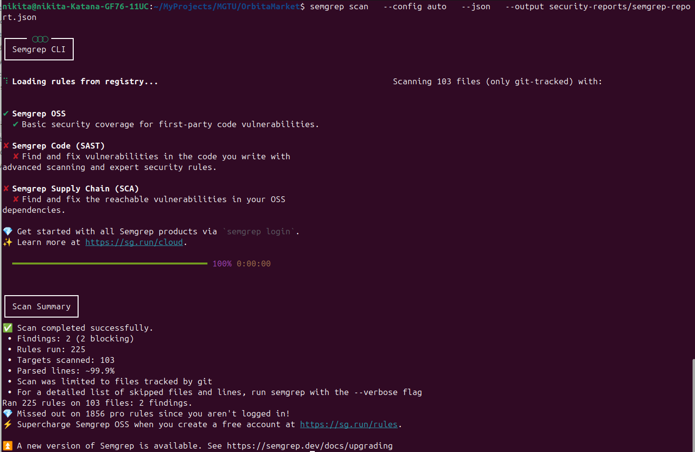

# Триаж проекта OrbitaMarket

Команды, использованные для поиска уязвимостей:

- gitleaks detect --source .   --report-format json   --report-path security-reports/gitleaks-history-report.json   --verbose   --no-git
- semgrep scan   --config auto   --json   --output security-reports/semgrep-report.json

## Найденные уязвимости

| Инструмент | Результат                       |
| ---------- | ------------------------------- |
| Gitleaks   | No leaks found                  |
| Semgrep    | 9 findings (3 ERROR, 6 WARNING) |
## Анализ уязвимостей

**Все уязвимости так же представлены в файле: semgrep-report_errors.json**
**Так как Gitleaks не нашёл уязвимостей файл - gitleaks-report_errors.json пустой**

| №   | Критичность    | Файл                                   | CWE     | Описание проблемы                                                                                                             | Исправление                                               | Решение          |
| --- | -------------- | -------------------------------------- | ------- | ----------------------------------------------------------------------------------------------------------------------------- | --------------------------------------------------------- | ---------------- |
| 1   | 🔴 **ERROR**   | gateway/Dockerfile                     | CWE-269 | Контейнер запускается от `root`. Если злоумышленник получит контроль над процессом, он будет иметь полный доступ к контейнеру | Добавить `USER non-root` перед `ENTRYPOINT`               | Исправить        |
| 2   | 🔴 **ERROR**   | orders-service/Dockerfile              | CWE-269 | Контейнер запускается от `root`. Если злоумышленник получит контроль над процессом, он будет иметь полный доступ к контейнеру | Добавить `USER non-root` перед `ENTRYPOINT`               | Исправить сейчас |
| 3   | 🔴 **ERROR**   | payments-service/Dockerfile            | CWE-269 | Контейнер запускается от `root`. Если злоумышленник получит контроль над процессом, он будет иметь полный доступ к контейнеру | Добавить `USER non-root` перед `ENTRYPOINT`               | Исправить сейчас |
| 4   | 🟡 **WARNING** | docker-compose.yml Сервис: postgres | CWE-732 | Возможность повышения привилегий через setuid/setgid бинарники                                                                | Добавить `security_opt: [no-new-privileges:true]`         | Исправить сейчас |
| 5   | 🟡 **WARNING** | docker-compose.yml Сервис: postgres | CWE-732 | Корневая файловая система доступна для записи. Malicious приложения могут модифицировать файлы контейнера                     | Добавить `read_only: true` + `tmpfs` для временных файлов | Исправить позже  |
| 6   | 🟡 **WARNING** | docker-compose.yml Сервис: kafka    | CWE-732 | Возможность повышения привилегий через setuid/setgid бинарники                                                                | Добавить `security_opt: [no-new-privileges:true]`         | Исправить сейчас |
| 7   | 🟡 **WARNING** | docker-compose.yml Сервис: kafka    | CWE-732 | Корневая файловая система доступна для записи. Malicious приложения могут модифицировать файлы контейнера                     | Добавить `read_only: true` + `tmpfs` для временных файлов | Исправить позже  |
| 8   | 🟡 **WARNING** | docker-compose.yml Сервис: kafka-ui | CWE-732 | Возможность повышения привилегий через setuid/setgid бинарники                                                                | Добавить `security_opt: [no-new-privileges:true]`         | Исправить сейчас |
| 9   | 🟡 **WARNING** | docker-compose.yml Сервис: kafka-ui | CWE-732 | Корневая файловая система доступна для записи. Malicious приложения могут модифицировать файлы контейнера                     | Добавить `read_only: true` + `tmpfs` для временных файлов | Исправить сейчас |

---

---
## Исправление уязвимостей

**Результаты анализа после исправления уязвимостей так же записаны в файле semgrep-report_fix.json**

